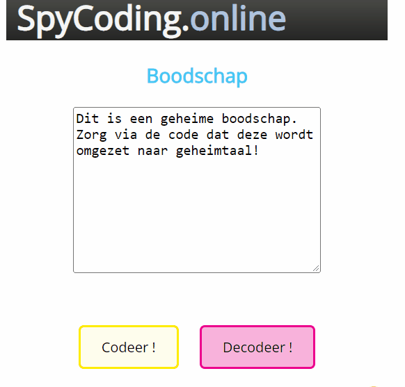

# pe01-codering
PE 01 : Coderingstool

# Doelstellingen 
De student :
- Bepaalt het eigen handelen uit de methodiek en doelstellingen die worden opgemaakt
- Onderscheidt de verschillende componenten voor het maken van een functionele gebruikersinterface
- Brengt de componenten van de gebruikersinterface in verband met de gewenste functionaliteiten van de applicatie
- Selecteert de nodige tools en componenten voor het implementeren van de applicatie
- Maakt eenvoudige softwareapplicaties
- Selecteert de best passende gegevensstructuren
- Construeert een logische en samenhangende programmacode

# Benodigdheden
- Visual Studio Code (of editor naar keuze)
- Syllabus H1-H7
- Andere bronnen (PluralSight, ...)

# Indienen
Dien je oplossing in via GitHub Classrooms voor het einde van de deadline (zie Leho).
Vergeet de aangeleerde afspraken niet (Continuous Integration Basics):
- Commit en Push often

# Opgave
Maak een Frontend Applicatie die zorgt voor de versleuteling van een bericht.
We gebruiken hiervoor een code die reeds succesvol werd gebruikt door spionagediensten.  
Eens je de sleutel `codingKey` kent kan je de boodschap terug ontcijferen.

## ScreenCast
Basisfunctionaliteit

## Functionaliteiten
## Codeersleutel
De codeersleutel werkt als volgt :  
 
Het eerste karakter in de zin wordt vervangen door het eerste karakter na het karakter in de codeersleutel, het 2de karakter door de tweede karakter na het karakter in de codeersleutel, enz...  
Valt het vervangende karakter buiten de index van de codeersleutel dan wordt de lengte van de codeersleutel afgetrokken van de berekende positie van het vervangkarakter.
Wanneer het karakter niet voorkomt in de codeersleutel dan wordt deze niet omgezet.

## Tips en tricks
De startsituatie omvat :
- De basistemplate voor HTLM `index.html`
- De basis css - `stylesheet.css` voor deze oefening
- Een script-file - `script.js` met daarin de `codingKey` 

Begin tijdig aan de opdracht!

(Best Practices)
1. Voorzie de basis html
2. Voorzie de nodige basis-css
3. Voorzie eerst coding-functionaliteit
4. ...

**Commit (en Push) (minstens) per afgewerkte functionaliteit volgens de afspraken CIB**

(Extra's)
- Voorzie van een eigen layout (wees creatief)
- Voorzie extra functionaliteiten (maar zorg dat de basis aanwezig is)
- ...

## Score
Leho - Rubric (zie opdracht)